# Hierarchical Conversation GNN Architecture v2

## Overview

The Hierarchical Conversation GNN v2 is an advanced two-level graph neural network that learns conversation context through sophisticated **token-level** and **message-level** processing. This enhanced architecture introduces learnable attention mechanisms that bridge the token and message hierarchies, enabling fine-grained understanding of conversational dependencies.

## Key Architectural Enhancements

### 1. **Learnable Token-to-Message Attention**
Instead of simple pooling, the model learns which tokens are most important for message representation. **This preserves critical signals** - if "it" is important, the attention mechanism will weight it highly.

### 2. **Cross-Message Token Attention**
Tokens can attend to tokens in other messages, capturing fine-grained cross-message dependencies. **This is the key innovation** - the pronoun "it" in message 10 can directly attend to "Redis instance" in message 1, preserving the coreference signal BEFORE any pooling occurs.

### 3. **Multi-Objective Training**
Combines relevance, contrastive, ranking, and margin losses for robust learning.

### 4. **Dynamic Role and Position Encoding**
Flexible handling of conversation metadata without hard-coded assumptions.

## High-Level Architecture


## Learnable Token-to-Message Attention

This mechanism learns which tokens contribute most to the message representation:


### Mathematical Formulation

```
For tokens t₁, t₂, ..., tₙ in a message:

q = LayerNorm(mean(t₁, ..., tₙ)) @ W_query  # Query is aggregate
K = [t₁, ..., tₙ] @ W_key                   # But keys are per-token
V = [t₁, ..., tₙ] @ W_value                 # Values are per-token

α = softmax(q @ K^T / √d_k)  # Learn which tokens matter
message_embedding = α @ V     # Weighted sum, NOT uniform pooling

Example weights for "How do I configure it?":
α = [0.05, 0.10, 0.05, 0.15, 0.60, 0.05]
                               ↑
                      "it" gets 60% weight!
```

## Addressing the "Information Bottleneck" Problem

Traditional architectures suffer from information loss when compressing token representations into message embeddings. Our architecture solves this in two ways:

1. **Learnable Attention (Not Pooling)**: The token-to-message attention learns to preserve important tokens. Unlike mean/max pooling which treats all tokens equally, our attention mechanism can give high weight to critical tokens like pronouns, entities, or technical terms.

2. **Cross-Message Token Attention**: Before any compression happens, tokens can directly attend to tokens in other messages. This means:
   - The pronoun "it" can find "Redis instance" across messages
   - Technical terms can connect to their definitions
   - Coreference chains are preserved at the token level

### Example: Pronoun Resolution
```
Message 1: "You should use Redis for caching"
Message 10: "How do I configure it?"

Traditional pooling: "it" gets averaged away
Our approach: 
- Token attention identifies "it" as important (high attention weight)
- Cross-message attention connects "it" → "Redis"
- Signal preserved through to message embeddings
```

## Cross-Message Token Attention

Allows tokens to attend to relevant tokens in other messages:


### Dependency-Aware Masking


## Enhanced Token Graph Structure


**Edge Types:**
- **Sequential**: Adjacent tokens (bidirectional)
- **Skip-2**: Bigram patterns
- **Global**: [CLS] and [SEP] to content words
- **Self-loops**: Information retention (all nodes)

## Message Graph with Semantic Edges


**Edge Types:**
- **Temporal**: Sequential conversation flow
- **Topic Reference**: Topical connections
- **Continuation**: Direct follow-ups
- **Clarification**: Questions about previous content

## Multi-Objective Training


### Adaptive Loss Weighting

```python
# Dynamically weight relevance loss based on training progress
relevance_weight = 1.0 + 0.5 * (1 - epoch / max_epochs)
```

## Complete Information Flow


## Key Architectural Components

### 1. Token Embedding Layer

```mermaid
graph LR
    subgraph "Token Embedding Details"
        TID["Token ID"] --> EMBED["Embedding<br/>Matrix<br/>30522 × 256"]
        PID["Position ID"] --> PEMBED["Position<br/>Matrix<br/>512 × 256"]
        RID["Role ID"] --> SEGMENT["Segment<br/>Matrix<br/>3 × 256"]
        
        EMBED --> ADD["Element-wise<br/>Addition"]
        PEMBED --> ADD
        SEGMENT --> ADD
        
        ADD --> NORM["LayerNorm"]
        NORM --> DROP["Dropout<br/>p=0.1"]
    end
```


### 2. GAT Layer Architecture


### 3. Relevance Scoring Network


## Model Statistics


## Training Innovations

### 1. Curriculum Learning


### 2. Temperature Scheduling


### 3. Negative Sampling Strategy


## Performance Optimizations

### 1. Efficient Attention Computation
- Vectorized cross-message attention
- Sparse attention patterns for long conversations
- Gradient checkpointing for memory efficiency

### 2. Dynamic Batching
- Groups conversations by length
- Minimizes padding overhead
- Enables larger effective batch sizes

### 3. Mixed Precision Training
- FP16 for forward pass
- FP32 for loss computation
- 2x speedup with minimal accuracy loss

## Advantages Over Previous Version

1. **Better Token Understanding**: Learnable attention identifies important tokens instead of uniform pooling

2. **Fine-grained Dependencies**: Cross-message token attention captures pronoun references and entity mentions

3. **Robust Training**: Multi-objective learning prevents overfitting to single metric

4. **Flexible Architecture**: Easily extended with new edge types or attention patterns

5. **Production Ready**: Optimized for both training efficiency and inference speed

## Future Extensions

1. **Syntax-Aware Edges**: Incorporate dependency parsing for richer token graphs
2. **Entity Tracking**: Special handling for named entities across messages  
3. **Multilingual Support**: Language-agnostic token processing
4. **Adaptive Architecture**: Dynamic depth based on conversation complexity
5. **Explainable Attention**: Visualize why certain contexts were selected