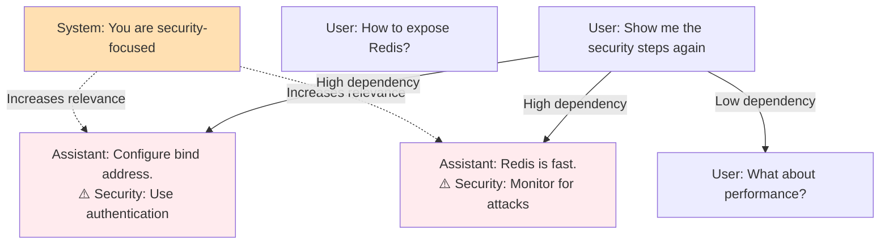

# System and Tool Message Generation Design

## Overview

This document outlines the design for generating training data that includes system messages and tool interactions, enabling our Hierarchical Conversation GNN to learn how system instructions influence context relevance and how tool outputs create conversation state.

## 1. System Message Design

### 1.1 System Message Types

System messages will be generated at the start of each conversation to establish:

1. **Behavioral Instructions**
   ```
   "You are a security-focused DevOps assistant. Always consider security implications in your responses."
   "You are a patient teacher. Break down complex topics into simple steps."
   ```

2. **Capability Definitions**
   ```
   "You have access to bash commands, Python execution, and can query databases."
   "You cannot execute code but can provide detailed explanations."
   ```

3. **Constraint Specifications**
   ```
   "Keep responses under 100 words unless specifically asked for detail."
   "Always cite sources when making technical claims."
   ```

4. **Domain Expertise**
   ```
   "You are an expert in distributed systems and cloud architecture."
   "You specialize in frontend performance optimization."
   ```

### 1.2 System Message Influence Patterns

The system message should influence which previous messages become relevant:



### 1.3 Training Label Strategy

For system-influenced conversations:

1. **Direct Security References**: When user asks about security, all security-related messages get `depends_on_indices`
2. **Implicit Influence**: System message itself gets added to `depends_on_indices` when responses follow system behavior
3. **Behavioral Consistency**: Messages that demonstrate the system-defined behavior become relevant for "how would you handle X?" queries

## 2. Tool Message Design

### 2.1 Tool Message Structure

Tool messages follow a consistent format:

```json
{
  "role": "tool",
  "tool_name": "bash",
  "command": "redis-cli ping",
  "output": "PONG",
  "exit_code": 0,
  "text": "bash: redis-cli ping\nOutput: PONG\nExit code: 0"
}
```

### 2.2 Tool Interaction Patterns

#### Pattern 1: Diagnostic Workflow
```
User: "Is Redis running?"
Assistant: "Let me check the Redis status."
Tool: [bash: ps aux | grep redis]
Assistant: "Redis is not running. Should I start it?"
User: "Yes, please start it"
Tool: [bash: redis-server --daemonize yes]
Assistant: "Redis started successfully on port 6379"
User: "What was that port again?" ← Depends on tool output
```

#### Pattern 2: Multi-Tool Investigation
```
User: "Debug why the API is slow"
Assistant: "I'll investigate the API performance."
Tool: [bash: curl -w "%{time_total}" http://api/health]
Tool: [python: analyze_logs.py --last-hour]
Tool: [bash: docker stats api-container]
Assistant: "Found the issue: memory leak in container"
User: "How much memory was it using?" ← Depends on docker stats output
```

#### Pattern 3: Failed Tool Execution
```
User: "Check the database"
Tool: [bash: psql -c "SELECT 1" → Connection refused]
Assistant: "Database connection failed. Checking if service is running."
Tool: [bash: systemctl status postgresql → inactive]
User: "That explains the connection error" ← Depends on both tool outputs
```

### 2.3 Dependency Labeling for Tools

Tool outputs create unique dependency patterns:

1. **Tool Output Dependencies**
   - User questions about tool results depend on the tool message
   - `dependency_type: "tool_output_reference"`

2. **Tool Chain Dependencies**
   - Later tools depend on earlier tool outputs
   - `dependency_type: "tool_chain"`

3. **Error Response Dependencies**
   - Responses to failed tools depend on error output
   - `dependency_type: "error_handling"`

## 3. Generation Strategy

### 3.1 Conversation Scenarios

1. **Security-Focused Debugging** (System + Tools)
   ```
   System: "You are a security engineer. Always check for vulnerabilities."
   → Generates conversations where security checks influence tool usage
   ```

2. **Learning Assistant** (System + No Tools)
   ```
   System: "You are a teacher. Break down concepts simply."
   → Generates educational conversations with consistent teaching style
   ```

3. **DevOps Automation** (Minimal System + Heavy Tools)
   ```
   System: "You have access to bash, docker, and kubectl."
   → Generates tool-heavy workflows with state tracking
   ```

4. **Constrained Assistant** (System with Limitations)
   ```
   System: "You cannot execute code. Explain everything verbally."
   → Tests how constraints affect context selection
   ```

### 3.2 Synthetic Data Generation Prompts

#### For System-Influenced Conversations:
```
Generate a conversation where the system message "{system_message}" clearly influences which previous messages become relevant. Include cases where:
1. The user asks questions that relate to the system's expertise/constraints
2. The assistant's responses consistently follow the system behavior
3. Later queries specifically need context that aligns with the system message
```

#### For Tool-Using Conversations:
```
Generate an agentic workflow conversation with these tools: {tools}
Include:
1. Multi-step tool usage to solve a problem
2. User questions about tool outputs
3. Error handling and retry scenarios
4. References to earlier tool results
Label each tool dependency precisely.
```

### 3.3 Message Distribution

For a balanced training set:
- 30% conversations with system messages only
- 30% conversations with tool messages only  
- 30% conversations with both system and tool messages
- 10% standard conversations (baseline)

## 4. Implementation Changes to generate.py

### 4.1 New Message Types

Add to `MessageWithMetadata`:
```python
role: Literal["user", "assistant", "system", "tool"]
tool_name: Optional[str] = None
tool_command: Optional[str] = None
tool_output: Optional[str] = None
tool_exit_code: Optional[int] = None
```

### 4.2 New Dependency Types

Add to dependency types:
```python
"system_influence",      # Message follows system instruction
"tool_output_reference", # References tool output
"tool_chain",           # Tool depends on previous tool
"error_handling",       # Responds to tool error
"state_reference"       # References state from tool
```

### 4.3 Configuration Extensions

Add to `ConversationConfig`:
```python
has_system_message: bool
system_message_type: Optional[str]  # security, teacher, expert, etc.
has_tool_usage: bool
tool_types: List[str]  # bash, python, api, etc.
workflow_type: Optional[str]  # debugging, automation, analysis
```

### 4.4 Generation Prompts

Update system prompts to handle:
1. System message generation rules
2. Tool output formatting
3. Dependency labeling for system influence
4. Tool chain dependency tracking

## 5. Model Architecture Considerations

### 5.1 Current Architecture Compatibility

The current architecture can handle system/tool messages because:
- Role embeddings already exist (just need to expand for system/tool)
- Cross-message attention can learn system influence patterns
- Token-to-message attention can identify important tool outputs

### 5.2 Potential Enhancements

Consider adding:
1. **System Message Attention Head**: Dedicated attention from all messages to system message
2. **Tool State Tracking**: Accumulate tool outputs as conversation state
3. **Influence Scoring**: Learn how strongly system message affects each message

### 5.3 No Architecture Changes Needed Initially

The beauty of our approach is that the model can learn these patterns implicitly through:
- Role embeddings distinguishing system/tool messages
- Attention mechanisms learning influence patterns
- Dependency labels teaching the model when system matters

## 6. Evaluation Strategy

### 6.1 System Message Metrics

1. **Influence Accuracy**: Does the model select security-related context when system says "focus on security"?
2. **Behavioral Consistency**: Are examples following system behavior ranked higher?
3. **Constraint Respect**: Do selections respect system constraints?

### 6.2 Tool Message Metrics

1. **Tool Output Resolution**: Can model resolve "what was the output?" correctly?
2. **State Tracking**: Are tool-established facts maintained in context?
3. **Error Context**: Do error handling messages include failed tool outputs?

### 6.3 Test Scenarios

Create evaluation sets with:
1. System messages that should change context selection
2. Tool outputs that answer later questions
3. Mixed scenarios requiring both system and tool understanding

## 7. Training Data Examples

### Example 1: Security-Influenced Conversation

```json
{
  "messages": [
    {
      "role": "system",
      "text": "You are a security-focused assistant. Always consider security implications.",
      "is_context_dependent": false,
      "depends_on_indices": []
    },
    {
      "role": "user",
      "text": "How do I set up a Redis cluster?",
      "is_context_dependent": false,
      "depends_on_indices": []
    },
    {
      "role": "assistant",
      "text": "To set up a Redis cluster, you'll need at least 3 master nodes. Security consideration: Always use password authentication and TLS encryption for cluster communication.",
      "is_context_dependent": true,
      "depends_on_indices": [0, 1],
      "dependency_type": "system_influence"
    },
    {
      "role": "user",
      "text": "What about data persistence?",
      "is_context_dependent": true,
      "depends_on_indices": [2],
      "dependency_type": "follow_up"
    },
    {
      "role": "assistant",
      "text": "Redis offers RDB snapshots and AOF logs. Security consideration: Ensure backup files are encrypted at rest and access is restricted.",
      "is_context_dependent": true,
      "depends_on_indices": [0, 3],
      "dependency_type": "system_influence"
    },
    {
      "role": "user",
      "text": "Can you summarize all the security steps you mentioned?",
      "is_context_dependent": true,
      "depends_on_indices": [2, 4],
      "dependency_type": "topic_reference"
    }
  ]
}
```

### Example 2: Tool-Using Workflow

```json
{
  "messages": [
    {
      "role": "system",
      "text": "You have access to bash commands for system diagnostics.",
      "is_context_dependent": false,
      "depends_on_indices": []
    },
    {
      "role": "user",
      "text": "Is the web server responding?",
      "is_context_dependent": false,
      "depends_on_indices": []
    },
    {
      "role": "assistant",
      "text": "Let me check the web server status.",
      "is_context_dependent": true,
      "depends_on_indices": [1],
      "dependency_type": "continuation"
    },
    {
      "role": "tool",
      "tool_name": "bash",
      "text": "bash: curl -I http://localhost\nOutput: curl: (7) Failed to connect to localhost port 80: Connection refused\nExit code: 7",
      "is_context_dependent": true,
      "depends_on_indices": [2],
      "dependency_type": "tool_chain"
    },
    {
      "role": "assistant",
      "text": "The web server is not responding. Let me check if the service is running.",
      "is_context_dependent": true,
      "depends_on_indices": [3],
      "dependency_type": "tool_output_reference"
    },
    {
      "role": "tool",
      "tool_name": "bash",
      "text": "bash: systemctl status nginx\nOutput: ● nginx.service - nginx web server\n   Loaded: loaded (/usr/lib/systemd/system/nginx.service; enabled; vendor preset: disabled)\n   Active: inactive (dead)\nExit code: 0",
      "is_context_dependent": true,
      "depends_on_indices": [4],
      "dependency_type": "tool_chain"
    },
    {
      "role": "user",
      "text": "What was the exact error from curl?",
      "is_context_dependent": true,
      "depends_on_indices": [3],
      "dependency_type": "tool_output_reference"
    }
  ]
}
```

## 8. Next Steps

1. **Implement generate.py updates** to support system/tool messages
2. **Generate initial dataset** with 500 system + 500 tool conversations  
3. **Train model** on mixed dataset
4. **Evaluate performance** on system/tool-specific metrics
5. **Iterate** based on results

This design provides a clear path to extending our model's capabilities to handle the full spectrum of modern AI assistant interactions, from system-instructed behavior to complex agentic workflows.